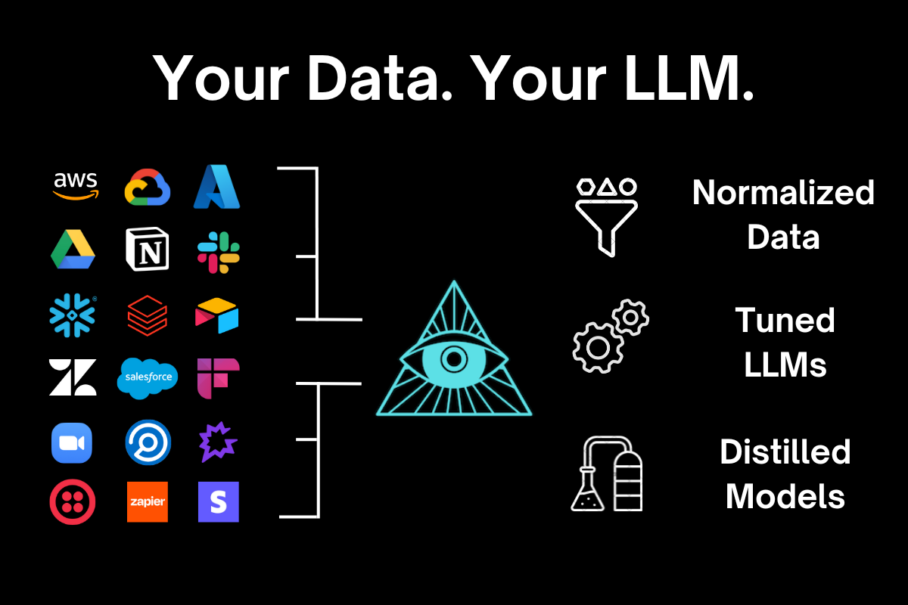

## You have the data. Train your own models.

Unlock the potential of your data and build bespoke language models that cater specifically to your business needs. 

With Anarchy, your data remains yours. Don't let tricky needs slow you down.

## Why Anarchy?

Anarchy isn't really a platform: it's a philosophy built on the principles of data sovereignty, customization, and innovation.

<CardGroup cols={2}>
  <Card title="Data Sovereignty" icon="lock">
    Retain full control and ownership of your data.
  </Card>
  <Card title="Tailored Solutions" icon="check">
    Customize your language models to fit your unique business needs.
  </Card>
  <Card title="Cost Efficiency" icon="dollar-sign">
    Reduce dependency on third-party providers.
  </Card>
  <Card title="Scalable Infrastructure" icon="server">
    Scale your operations seamlessly with a robust infrastructure.
  </Card>
  <Card title="Cutting-Edge Technology" icon="rocket">
    Leverage the latest advancements in AI to stay ahead of the competition.
  </Card>
  <Card title="Dedicated Support" icon="headset">
    Benefit from our dedicated support team, ready to assist you at every step.
  </Card>
</CardGroup>

## Harness your data's true potential

Your data, your models, your success.

<CardGroup cols={2}>
  <Card title="Data Tsunami" icon="wave">
    The data floodgates have opened—time to ride the wave and make that data work for you.
  </Card>
  <Card title="Regulatory Pressures" icon="shield">
    With GDPR, CCPA, and other regulations tightening, controlling your data isn't just smart—it's mandatory.
  </Card>
  <Card title="Demand for Customization" icon="sliders">
    Generic solutions no longer suffice. Your unique challenges demand equally unique solutions.
  </Card>
  <Card title="Operational Scalability" icon="chart-line">
    As your business scales, so do your data needs.
  </Card>
  <Card title="Strategic Data Utilization" icon="lightbulb">
    Data is your most strategic asset. Use it wisely.
  </Card>
  <Card title="Security Imperatives" icon="lock">
    Protecting your data from breaches and leaks is critical. Don't want your data used to fine-tune other models, right?
  </Card>
</CardGroup>