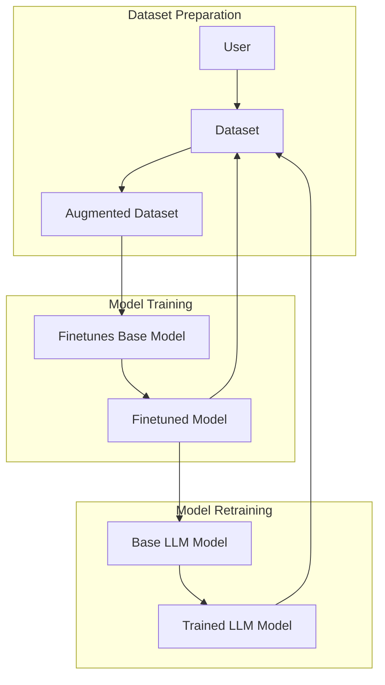

<Info>
Ensuring your datasets are properly versioned and managed collaboratively is essential for maintaining accuracy and relevance in your AI models.
</Info>

## Data Operations

Functionally, managing and updating datasets is no different than what you've already done to create or augment your datasets. To add to a dataset, simply navigate to that dataset within the platform.

Once you're viewing an existing dataset, you can add rows, augment it, or create a new finetune using a pre-customized model.

## The Training Loop

<Card title="The Accuracy Pinwheel" icon="fan">
 The feedback loop in model training involves using a trained model to generate or refine data, which then further improves the model in subsequent training cycles. This continuous improvement cycle is key to developing smarter, more accurate models over time.
</Card>

The training loop for AI models works like this: You start with a basic model and improve it by teaching it with special data. After training, the model gets better and you use it to create even better data for more training, making the model smarter each time.

If necessary, you can always revert to a previous dataset or model.